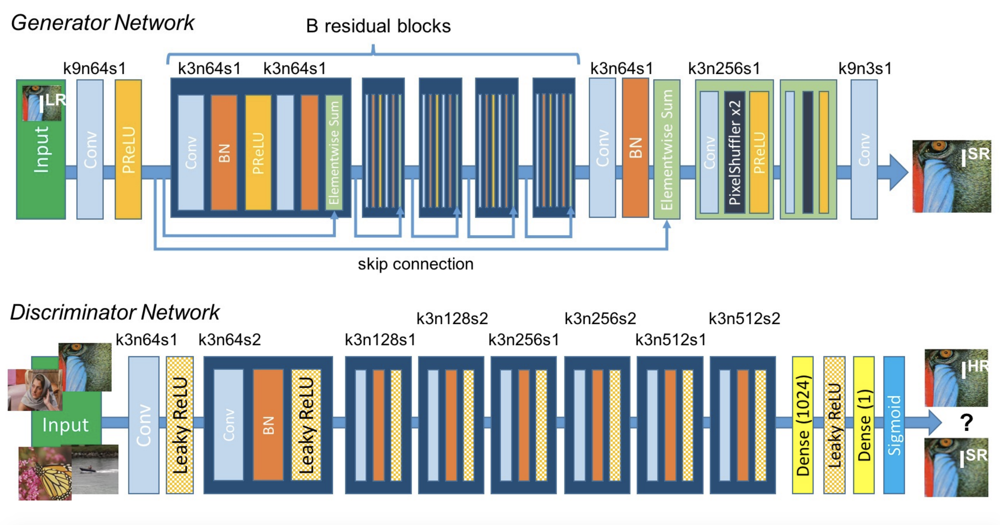

# Super-Resolution GAN (SRGAN)
### Deep Learning (CS1470): Final Project

*Team members*: Zsozso Biegl, Isa Milefchik, Tiffany Nguyen, Rachel Wang



### (Planned) Usage:

Training:

```
python3 main.py --train <training data folder>
```

Inference:

```
python3 main.py --infer <input image filepath>
```