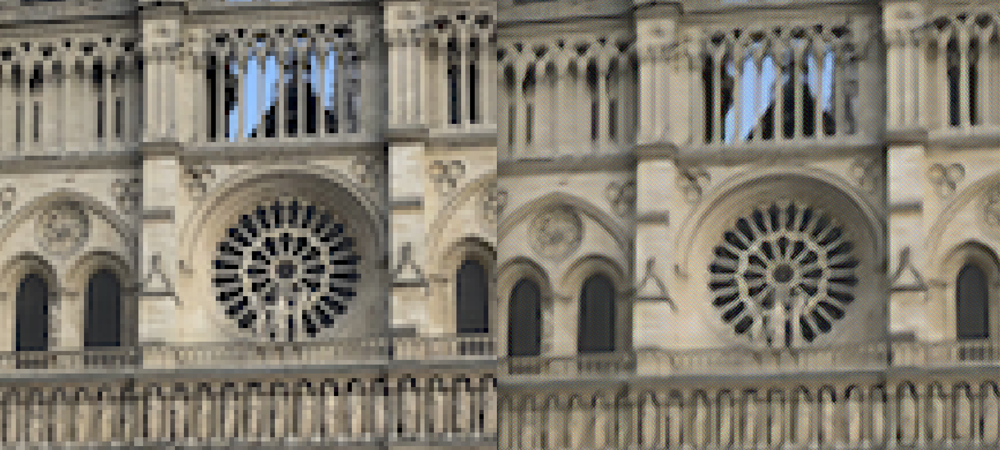

# Super-Resolution GAN (SRGAN)
### Deep Learning (CS1470): Final Project

*Team members*: Zsozso Biegl, Isa Milefchik, Tiffany Nguyen, Rachel Wang


### Example Usage:

Display the help message:

```
python3 main.py -h
```

Training for 100 epochs from scratch using `.png` images stored in the folder `data`:

```
python3 main.py --train ./data --epochs 100
```

Training for 100 epochs, initializing the model using the latest checkpoint stored in the folder `checkpoints`:

```
python3 main.py --train ./data --epochs 100 --load ./checkpoints
```

Running inference on the image `scale_me.png`, initializing the model with the latest checkpoint in the folder `checkpoints` (the result will be stored in the current directory as `output.png`):

```
python3 main.py --infer scale_me.png --load ./checkpoints
```

### Current results:


